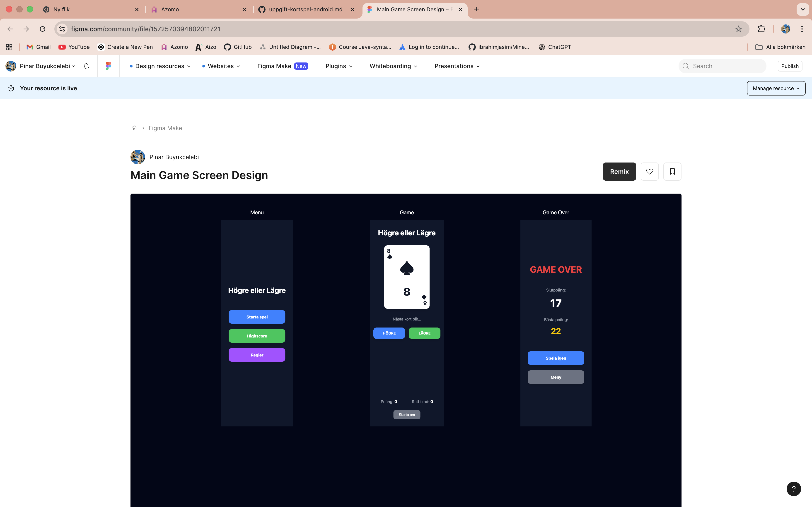

🃏 Higher or Lower - The Card Guessing Game

Welcome to **Higher or Lower**, a classic card guessing game for Android. 

The goal is simple: guess if the next card drawn from a standard 52-card deck will be higher or lower than the one you see. How long can your winning streak get?

## 🎨 UI and Design

The app features a clean, mobile-first design with a dark theme to keep the focus on the gameplay. The user interface is inspired by the provided Figma mockups and consists of three main screens.

| Screen         | Purpose                               | Key Elements                                                              |
| -------------- | ------------------------------------- | ------------------------------------------------------------------------- |
| **Menu**       | The game's entry point.               | "Start Game," "Highscore," and "Rules" buttons.                           |
| **Game Screen**| The core gameplay loop happens here.  | A large card display, "Higher" and "Lower" buttons, and the current score.  |
| **Game Over**  | Shows results after a wrong guess.    | A "Game Over" message, your final score, the best score, and options to "Play Again" or go to the "Menu". |

 

  

### Design Goals
*   **Responsive Layout**: The interface is optimized for a great experience on Android devices.
*   **Large Touch Targets**: Buttons are designed to be large and easy to tap.
*   **Clear Aesthetics**: The dark theme enhances contrast, making the card and game information stand out.

## ♠️ Game Logic

The game uses a standard, shuffled 52-card deck.

### Card Values
Card values are purely numerical. Suits (Hearts, Diamonds, Clubs, Spades) are for visual representation only and don't affect the game logic.

*   **Ace**: 1 (Lowest value)
*   **2-10**: Face value
*   **Jack**: 11
*   **Queen**: 12
*   **King**: 13 (Highest value)

### Gameplay Loop
1.  **Initial Draw**: The game starts by shuffling the deck and drawing the first card.
2.  **Player's Guess**: You guess whether the next card will be `HIGHER` or `LOWER`.
3.  **The Reveal**: A new card is drawn and compared to the previous one.
    *   **Correct Guess**: Your streak increases by 1. The new card is now the current card.
    *   **Incorrect Guess**: The game ends, and you're taken to the "Game Over" screen.
    *   **Tie (Same Value)**: A tie is considered an incorrect guess to make the game more challenging.

### Scoring
*   **Score**: Your score is your streak of consecutive correct guesses.
*   **Highscore**: The all-time best streak is saved and displayed.

## 🤝 Collaborators

This game was brought to life by the collaborative efforts of:

https://github.com/Pinar1987/higher-or-lower-game.git

*   **Pinar Buyukcelebi**
*   **Mazlum Binici**
